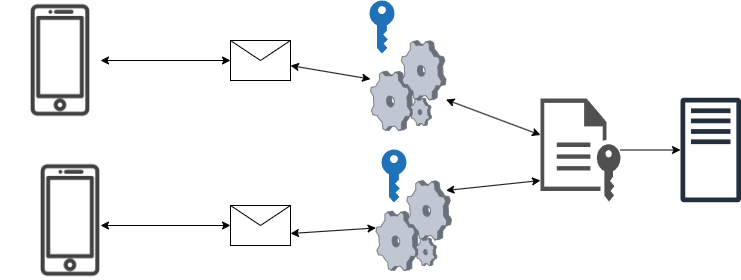
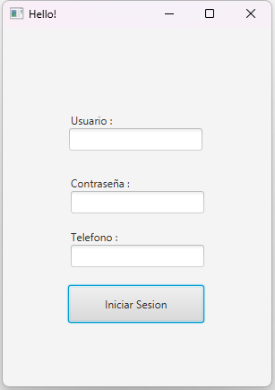
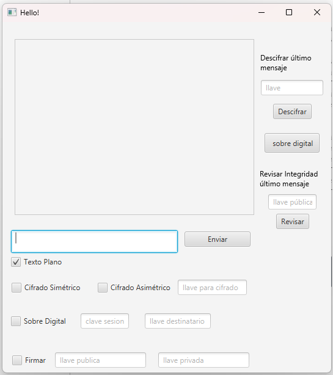
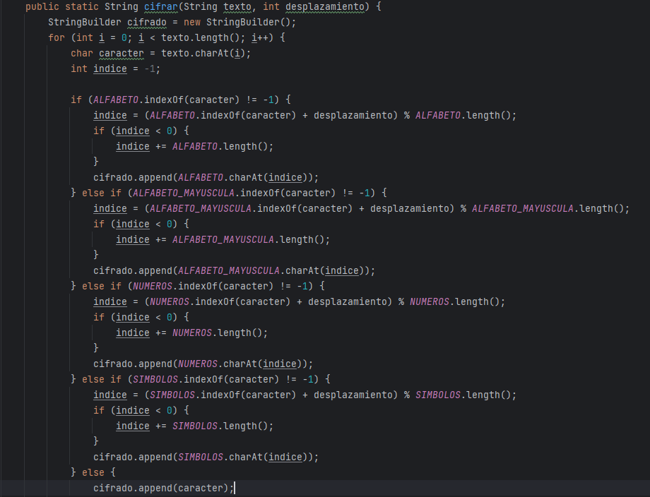
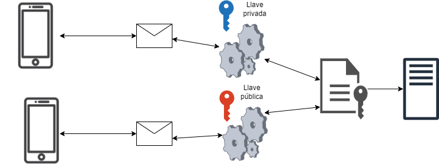
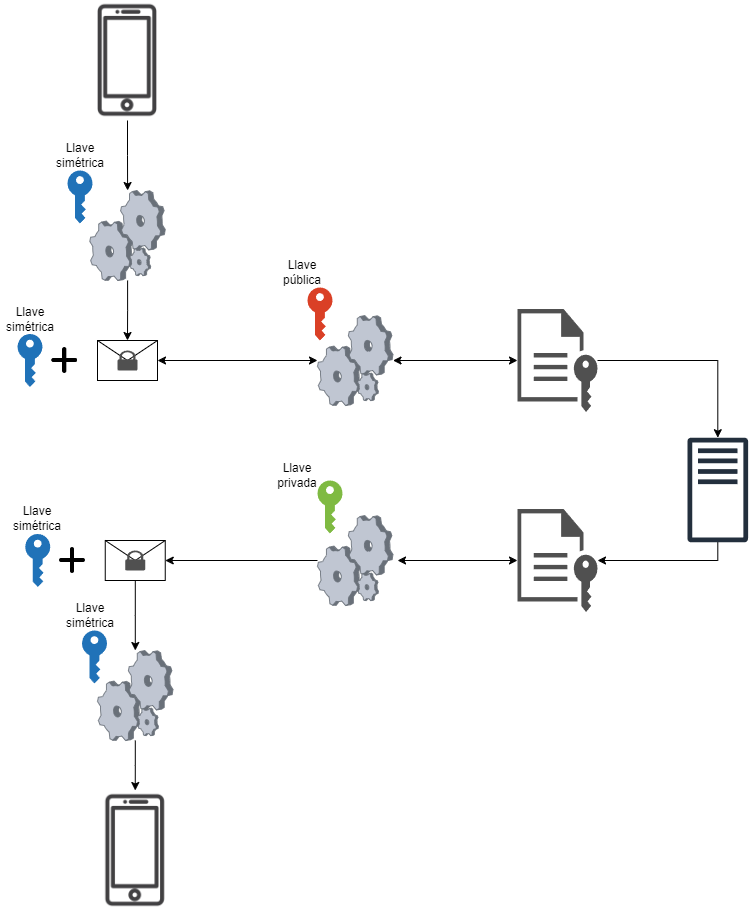
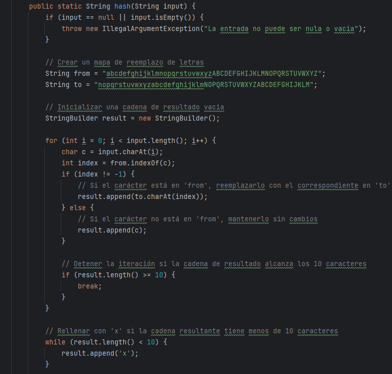
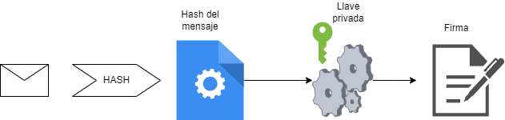

[^1] 

# Aplicación de Mensajería Segura “WhatsUP”

Esteban Viniegra Pérez Olagaray Universidad Panamericana, Escuela de Ingeniería.  \
Ingeniería en Inteligencia de datos y Ciberseguridad \
Materia: Criptografía y seguridad de redes

**_Resumen_—Este informe aborda la segunda entrega del proyecto que incluya varias medidas de seguridad para los mensajes. El objetivo principal es desarrollar una aplicación de mensajería instantánea que aproveche los principios de la criptografía para asegurar la seguridad de la información. El alcance de esta segunda entrega se centra en la implementación de varios tipos de cifrado, integración de sobres digitales, firma electrónica y generación de llaves simétricas y asimétricas.	**

1. 
Introducción
 La comunicación es una parte esencial de la vida humana, y cada vez más personas utilizan medios digitales para enviar y recibir mensajes. Sin embargo, estos medios pueden ser vulnerables a ataques informáticos que pongan en riesgo la privacidad y la integridad de los usuarios. Por eso, es importante contar con sistemas de mensajería segura que garanticen la confidencialidad, la autenticación y la no repudiación de los mensajes.

	Este proyecto consta de 2 partes, el cliente que manda los mensajes y puede realizar las diferentes tareas de cifrado y descifrado y el servidor, que se encarga de autenticar a los usuarios y también de mandar y recibir los mensajes. Ninguna tarea de cifrado o descifrado se hace del lado del servidor, por lo que podemos asegurar la confidencialidad de los datos.

    Fig 1. Diagrama de arquitectura del proyecto

2. 
Desarrollo
_A.		 Cliente_

El cliente ha sido actualizado en varios aspectos, es el elemento que más ha sufrido cambios desde la primera entrega.

    1. 
Interfaz gráfica
La interfaz gráfica ha tenido cambios significativos. Para empezar, ya se cuenta con una primera vista de inicio de sesión (Figura 2) Que tiene la función de autenticar a los usuarios. Fue desarrollada con JavaFX y su función es simplemente mandar datos al servidor.

                

    Fig 2. Interfaz gráfica de la vista de inicio de sesión

	También fue actualizada la vista de “chat” de la aplicación, ya no cuenta únicamente con una lista de mensajes recibidos y un espacio para mandar mensajes. Se agregaron varias opciónes de cifrado y descifrado de mensajes, opción para firmar los mensajes antes de mandarlos e incluso un apartado para crear un sobre digital antes de mandar el mensaje a cada destinatario, Más adelante en este mismo documento se abordarán los diferentes algoritmos criptográficos incluídos en el proyecto.

Fig. 3 Vista de “chat” de la aplicación.

_B.		Algoritmos de cifrado / descifrado_

Para este proyecto se desarrolló un algoritmo de sustitución simple, también es conocido como “cifrado César”. Este consta de desplazar una letra n número de veces en su valor numérico del abecedario, esto se repite con cada letra de una palabra y como resultado, tienes una palabra completamente distinta a la anterior y es posible revertir este algoritmo recorriendo n número de veces el valor numérico de cada letra, pero en sentido inverso.

Fig 4. Código del agoritmo de cifrado implementado en el proyecto.

Como se puede observar en la figura 4, el algoritmo implementado también permite cifrar y descifrar números y símbolos.

Tomando “llave” el número de desplazamiento, podemos optener un número que sea capaz de generar el mismo desplazamiento y por ende, sea capaz de descifrar un texto que haya sido cifrado con el desplazamiento original.

Gracias a esto podemos simular la creación de llaves simétricas y asimétricas y usar el mismo algoritmo de cifrado para cifrar y descifrar mensajes.

_C.		Cifrado simétrico_

Es el cifrado más simple, podemos observar un diagrama que representa este tipo de cifrado en la figura 1, ambos clientes están utilizando la misma llave para cifrar y descifrar un mensaje.

D. Cifrado asimétrico

	Al momento de realizar el cifrado, utiliza la llave privada y genera una llave pública y ambas serán capaces de cifrar y descifrar un mismo mensaje.

	Este tipo de cifrado es ampliamente utilizado en la industria para asegurar datos que únicamente el propietario puede saber porque una función de cifrado asimétrico bien implementada te deja cifrar con ambas llaves, pero únicamente la llave privada es capaz de descifrar el mensaje. 

Fig. 5 Cifrado Asimétrico

E. Sobre digital

	El sobre digital funciona con los 2 algoritmos vistos anteriormente, primero cifra el mensaje con una llave simétrica y empaqueta la llave simétrica y el mismo mensaje cifrado para después ser ambos cifrados de nuevo pero utilizando la llave pública del destinatario y para descifrar el mensaje primero es necesario descifrar el paquete con la llave simétrica y el mensaje cifrado y ya después será posible descifrar el mensaje con la llave simétrica que viene junto con el mensaje. 

Este tipo de cifrado es muy recomendable cuando se necesita mandar el mismo mensaje a diferentes destinatarios pero es de suma importancia asegurar el contenido, solo es necesario cifrar el sobre con la llave pública de cada destinatario y así, solo ellos con su llave privada serán capaces de descifrar el contenido.

Fig 6. Algoritmo de Cifrado con sobre digital

F. Función Hash

	Como tal, una función hash no cifra un mensaje, ya que una vez procesada cualquier cadena, ésta no puede volver a su forma original. Las características de una función hash segura son la falta de colisión, significa que 2 cadenas no generarán el mismo hash después de ser procesadas, la irreversibilidad y también asegura que cualquier cadena tenga la misma longitud después de ser procesada.

Fig 7. Función hash implementada en la aplicación

Las funciones hash son muy utilizadas en la industria para guardar contraseñas de manera segura, ya que no es posible saber cuál es la contraseña a partir de un hash

F. Firma digital

	Este algoritmo no es como tal un algoritmo de cifrado, pero utiliza el cifrado asimétrico para comprobar la integridad de un mensaje, archivo, ejecutable, etc.

Fig. 7 Algoritmo de firma digital

Para poder autenticar la integridad de un archivo no es suficiente la firma digital de ese archivo, es necesario el certificado digital, que es simplemente la firma del archivo y la llave pública de este.

Fig 8. Certificado digital

Y la forma de comprobar la integridad del archivo es descifrando la firma, que va a incluir el hash del archivo y compararlo con el hash del mismo archivo, si son idénticos, es porque es íntegro el archivo recibido.

3. 
Conclusiones

# Este proyecto ha logrado implementar varios mecanismos de seguridad para los mensajes en la aplicación de mensajería instantánea. Estos mecanismos incluyen cifrado simétrico, cifrado asimétrico, sobres digitales, funciones hash y firma digital.Estos mecanismos permiten garantizar la confidencialidad, la autenticación y la no repudiación de los mensajes.

4. 
Referencias

1.  A. K. Singh, “WebSocket Programming with Java,” Medium, 2023. [Online]. Disponible en: . [Accedido: 01-Nov-2023].
2.  J. A. Gómez, “Sockets en Java: Un sistema cliente-servidor con sockets,” 2023. [Online]. Disponible en: . [Accedido: 01-Nov-2023].

<!-- Footnotes themselves at the bottom. -->
## Notes

[^1]:
    * Escuela de ingeniería Universidad Panamericana.

